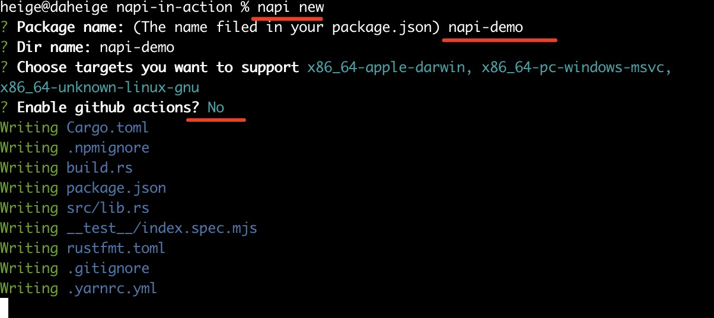

# napi-in-action
napi-rs is a framework for building pre-compiled Node.js addons in Rust.

# nodejs and rust version
- nodejs version >= v1.12
- rust version >= 1.63.0

参考地址：https://github.com/napi-rs/napi-rs#msrv

# napi文档
- https://crates.io/crates/napi
- https://github.com/napi-rs/napi-rs
- https://napi.rs/

# napi install
1. 首先需要安装好rust和nodejs
2. 设置好nodejs npm镜像
```shell
npm config set registry https://registry.npm.taobao.org
npm install -g cnpm --registry=https://registry.npm.taobao.org
```
3. 安装napi-cli
```shell
npm install -g @napi-rs/cli
```

# napi-cli使用
新建一个demo
```shell
napi new
? Package name: (The name filed in your package.json) napi-demo
? Dir name: napi-demo
? Choose targets you want to support (Press <space> to select, <a> to toggle all, <i> to
 invert selection, and <enter> to proceed)
❯◯ aarch64-apple-darwin
 ◯ aarch64-linux-android
 ◯ aarch64-unknown-linux-gnu
 ◯ aarch64-unknown-linux-musl
 ◯ aarch64-pc-windows-msvc
 ◯ armv7-unknown-linux-gnueabihf
 ◉ x86_64-apple-darwin
(Move up and down to reveal more choices)
? Choose targets you want to support x86_64-apple-darwin, x86_64-pc-windows-msvc,
x86_64-unknown-linux-gnu
? Enable github actions? (Y/n) n
# 填写对应的项目名字，以及选择不同的平台，一直回车即可

➤ YN0000: └ Completed in 6s 277ms
➤ YN0000: ┌ Link step
➤ YN0000: └ Completed in 1s 256ms
➤ YN0000: Done with warnings in 13s 519ms
#看到上面的这个表示项目创建成功
```
运行效果：


查看生成好的目录：
```shell
cd napi-demo
tree ./ -L 2
./
├── Cargo.toml
├── __test__
│ └── index.spec.mjs
├── build.rs
├── node_modules
│ ├── @isaacs
│ ├── @napi-rs
├── npm
│ ├── darwin-x64
│ ├── linux-x64-gnu
│ └── win32-x64-msvc
├── package.json
├── rustfmt.toml
├── src
│ └── lib.rs
└── yarn.lock
```
创建好的napi-demo/Cargo.toml
```toml
[package]
edition = "2021"
name = "napi-demo"
version = "0.0.1"

[lib]
crate-type = ["cdylib"]

[dependencies]
# Default enable napi4 feature, see https://nodejs.org/api/n-api.html#node-api-version-matrix
napi = { version = "2.12.2", default-features = false, features = ["napi4"] }
napi-derive = "2.12.2"

[build-dependencies]
napi-build = "2.0.1"

[profile.release]
lto = true
```
查看创建好的package.json
```json
{
  "name": "napi-demo",
  "version": "0.0.0",
  "main": "index.js",
  "types": "index.d.ts",
  "napi": {
    "name": "napi-demo",
    "triples": {}
  },
  "license": "MIT",
  "devDependencies": {
    "@napi-rs/cli": "^2.16.3",
    "ava": "^5.1.1"
  },
  "ava": {
    "timeout": "3m"
  },
  "engines": {
    "node": ">= 10"
  },
  "scripts": {
    "artifacts": "napi artifacts",
    "build": "napi build --platform --release",
    "build:debug": "napi build --platform",
    "prepublishOnly": "napi prepublish -t npm",
    "test": "ava",
    "universal": "napi universal",
    "version": "napi version"
  },
  "packageManager": "yarn@3.6.4"
}

```

# 开始运行
```shell
% npm install -g yarn
% yarn build # 构建编译
# 查看生成好的index.js
% ls
Cargo.lock			node_modules
Cargo.toml			npm
__test__			package.json
build.rs			rustfmt.toml
index.d.ts			src
index.js			target
napi-demo.darwin-x64.node	yarn.lock
```
测试二进制模块是否生效
```shell
yarn test

  ✔ sum from native
  ─

  1 test passed
```

# 为nodejs拓展新的函数
编辑src/lib.rs
```rust
#![deny(clippy::all)]

#[macro_use]
extern crate napi_derive;

#[napi]
pub fn sum(a: i32, b: i32) -> i32 {
  a + b
}

// 新增say_hello函数
#[napi]
pub fn say_hello(name:String){
  println!("hello,{}",name);
}
```
重新编译
```shell
% yarn build
   Compiling napi-demo v0.0.1 (/Users/heige/web/rust/napi-in-action/napi-demo)
    Finished release [optimized] target(s) in 6.38s
```
查看index.js发现已经新增了如下内容，表明新增的函数已经生效，该文件会根据不同的操作系统平台引入对应的.node文件。
```js
const { sum, sayHello } = nativeBinding

module.exports.sum = sum
module.exports.sayHello = sayHello
```
测试是否生效
```shell
% yarn test
hello,daheige
  ✔ sum from native
  ✔ say_hello from native
  ─

  2 tests passed
```
到这里完整的napi为nodejs编写原生二进制拓展.node已经完成✅

# 在nodejs文件中引入生成好的模块
vim demo.js 添加如下内容
```js
const mymod = require("./index.js");
console.log("1+2 = ",mymod.sum(1,2));
mymod.sayHello("napi demo");
```
执行如下命令，可以看到自定义的say_hello函数已经生效
- rust生成后的函数，在nodejs中是遵循驼峰命名风格sayHello
- 生成好的nodejs代码，放在index.js中

运行效果：
```shell
node demo.js
1+2 =  3
hello,napi demo
```
